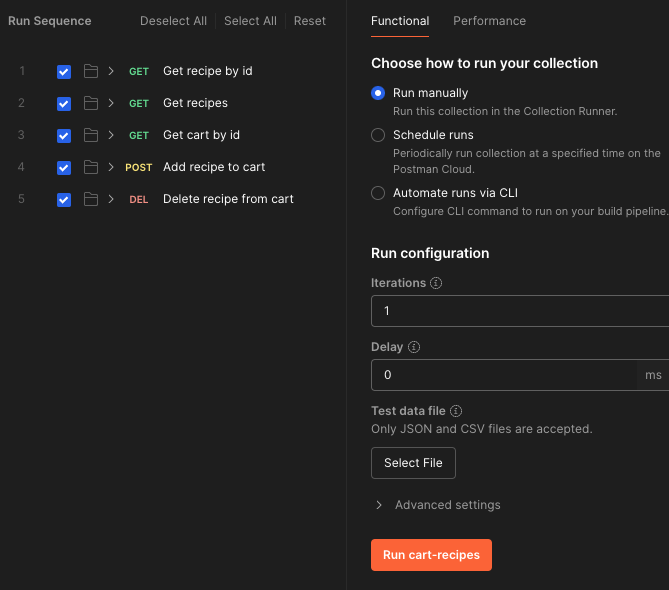
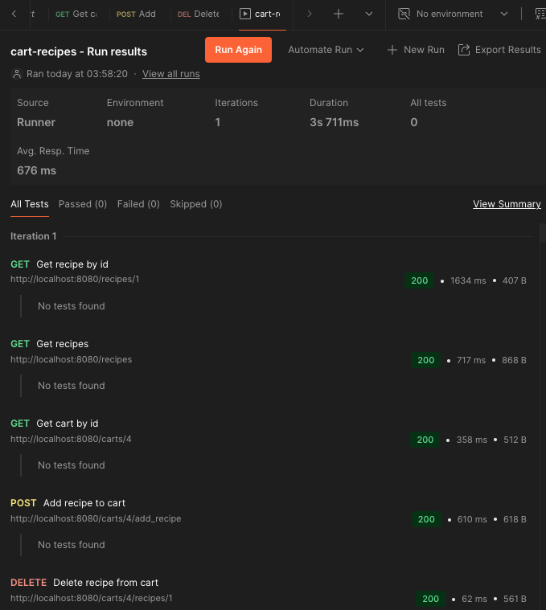

# Cart recipes

Demo application the exposes a REST API for managing the recipes in a shopping cart.

# Test the application

## Requirements
- Docker engine running locally
- Postman

## Start the application
Run the following command in a terminal session (not detached to see the SQL logs):
```bash
docker run --rm --name cart-recipes-alex -p 8080:8080 alexandrutopala/cart-recipes
```

## Import Postman collection
Import the Postman collection located in the repo `[cart-recipes.postman_collection.json](res/cart-recipes.postman_collection.json)`

## Run the collection
Right-click on the collection in Postman and hit Run. Keep the default settings as shown below.


Then hit `Run cart-recipes`. The result should look like this:



## Close the server
In the terminal session where you started the application, hit `Ctrl+C` to stop the server.

